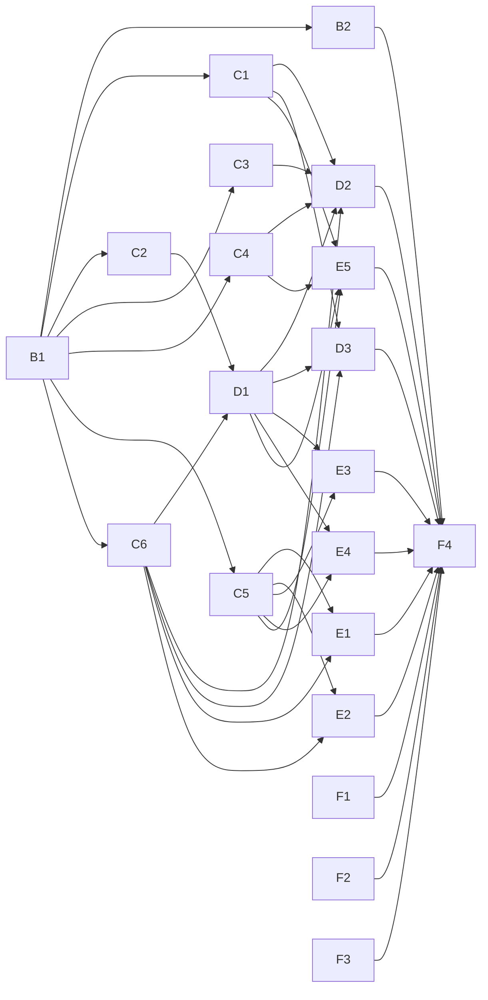

# Build backlog

Source of truth: [`spec.md`](spec.md) (requirement ids `R-*`), [`data-model.md`](data-model.md), `CONTEXT.md`. Each item becomes one GitHub issue in its milestone, with native blocking edges. An item owns the listed paths; it must not edit paths owned by another item in the same wave. Agents work in `.worktrees/<item-id>` on branch `build/<item-id>`.

## M1 Foundation (1 item; every later item depends on its contracts)

- **B1 Scaffold and shared contracts**: `go.mod` (Go 1.26), `cmd/f95-tracker` subcommand dispatch, `internal/config`, `internal/clock`, `internal/domain` (enums, Version normalizer + shared test vectors, sentinel errors), `internal/db` (Open, pragmas, pools, goose runner, `Store`, `00001_init.sql` from data-model.md, `sqlc.yaml`, one empty query file per area, committed sqlc output), `internal/backup` (VACUUM INTO), `internal/web` skeleton (router with per-area route files `routes_<area>.go`, middleware stubs, `/healthz`), `internal/web/ui` `layout.templ` + `components.templ` + per-area `views_<area>.go` convention, `internal/web/static` (tokens from the prototype, `input.css`, vendored htmx/Alpine/fonts), `internal/testutil` golden helper + DB builder, `justfile` (dev loop: templ watch, tailwind, sqlc). Accept: `go test ./...` and `go vet` pass; `serve` renders an empty layout and `/healthz`; migration applies on a fresh DB.

## M2 Core packages (parallel after B1)

- **B2 Nix flake, NixOS module, CI**: `flake.nix`, `nix/`, `.github/workflows/`. `packages.default` (buildGoModule, CGO off, Tailwind via `tailwindcss_4`), `devShells.default`, `nixosModules.default` with the R-DEP options, systemd service + timer + hardening + backup/restore wiring, `checks` (go test, vet, staticcheck, gofmt, templ/sqlc drift, `runNixOSTest` with a fake OIDC). CI runs `nix flake check` on PRs; garret push on `main` waits for F1's garret entry. R-DEP, R-TEST-5..7.
- **C1 F95 client**: `internal/f95`, `internal/fixture`, `internal/testutil/f95fake.go`, `testdata/f95/`. Limiter, cookie jar + persistence hook, UA, retries, caps, `checker.php`, thread parser (title, version, prefixes, tags, Genre text, cover, download block), cookie-header parser + probe, sanity checks, restricted/unavailable errors; `fixture` capture + scrubber; recorded fixtures (captured from the signed-in browser over CDP per the map Notes, then scrubbed). R-F95, R-TEST-1..3.
- **C2 Genre parser**: `internal/genre`, `testdata/genre/`. Pure parser per research rules; vocabulary/synonym seed data; golden tests from the 42 samples. R-TAG (parser part).
- **C3 itch.io check**: `internal/itch`, `internal/testutil/itchfake.go`, `testdata/itch/`. R-ITCH.
- **C4 Notifications**: `internal/notify`, `internal/db/queries/notify.sql`, `internal/testutil/ntfyfake.go`. ntfy client, digest builder (sections, 20-line cap), immediate pushes, bookkeeping. Download sections and the needs-human push come in G1. R-NOTIF.
- **C5 Auth**: `internal/auth`, `internal/db/queries/auth.sql`, `internal/testutil/oidcfake.go`, `internal/web/routes_auth.go`. OIDC + PKCE, scs SQLite store, subject allowlist, middleware. R-AUTH.
- **C6 Games service**: `internal/games`, `internal/db/queries/{games,sources,playlog,settings}.sql`. Add/remove, Sources, Play status, rating, Play log edits, Behind/Update queries, list filters/sorts, cover cache. R-UPD (queries), parts of R-UI behaviour.

## M3 Services (after their M2 inputs)

- **D1 Tags service**: `internal/tags`, `internal/db/queries/{tags,review}.sql`. Vocabulary growth, add-time parse-check model, merge on refresh, promotion, Tag review + queue, Synonym re-apply. Needs C2, C6. R-TAG.
- **D2 Daily check**: `internal/check`, `internal/db/queries/checks.sql`, `cmd` wiring for `check`. Run order, Update detection, cookie probe, detail queue (5 s, 40/day, weekly rolling), unavailable after 3 misses, itch step, digest send; end-to-end test with all fakes. Needs C1, C3, C4, C6, D1. R-UPD, R-F95 orchestration.
- **D3 CSV import**: `internal/csvimport`, `cmd` wiring for `import-csv`. Derivation rules, merges, idempotency, backfill at 1 req / 5 s; test against the real CSV with fakes. Needs C1, C6, D1. R-CSV.

## M4 Web UI (parallel after their services; designer reviews each)

Each item owns its `internal/web/routes_<area>.go`, `internal/web/ui/<page>.templ`, `views_<area>.go`.

- **E1 Game list + phone tab bar**: table layout, filters, Update/Behind-first sort, banners, entry strips. Needs C5, C6.
- **E2 Game detail**: header, Sources, refresh, Play status, half-star rating, Play log (edit/delete), mark played, tag groups, hand tag edits, Genre text. Needs C5, C6.
- **E3 Add Game + parse check**. Needs C5, D1.
- **E4 Tag review + queue**. Needs C5, D1.
- **E5 Settings + Import review**: cookie paste/status, alert set, Synonym editor, ntfy test; import review bulk edit. Needs C1, C4, C5, D1.

## M5 Deploy

- **F1 Dotfiles PR: tracker** (AFK, PR only): flake input, `legion.services.f95-tracker` on peria, sops shard + `.sops.yaml` rule, Gatus/monitoring, hermes SERVERS.md, topology, garret OIDC entry for this repo.
- **F2 Dotfiles PR: self-hosted ntfy** (AFK, PR only): `services.ntfy-sh` on peria, deny-all, tracker publish token, `upstream-base-url`.
- **F3 Manual setup checklist** (HITL): Pocket ID client + subject id, NetBird proxy services (`f95` NetBird-only, `ntfy` public), secret values into sops, ntfy phone login, make the repo public.
- **F4 Deploy and import** (HITL, needs approval): merge F1/F2, deploy peria, run `import-csv`, check the first digest, review imported Games.

## M6 Downloader (later milestone)

- **G1 Tracker side**: `internal/downloads`, `internal/api`, API tokens (issue/verify + Settings section), downloads page + paste page, Download button, digest sections and needs-human push. R-DL-1..5, R-TOK.
- **G2 Worker**: downloader binary, pixeldrain/mega/gofile adapters, extraction, resume. R-DL-6.
- **G3 `nixosModules.downloader`** + VM test.
- **G4 Userscript** (Violentmonkey).
- **G5 Dotfiles PR: artemis** + HITL (`migrate-persist`, `--boot` deploy, backup allowlist).

Parallel width: M2 runs 7 items at once; M4 runs 5.
